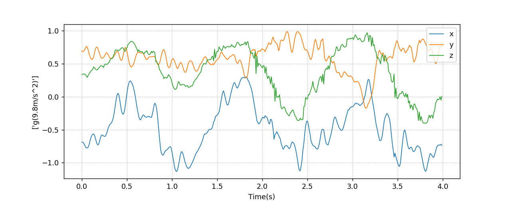

Jupyter MicroPython Upydevice Kernel
=====================================

Jupyter kernel to interact with a MicroPython board over its REPL
interface.

Typically used with MicroPython boards over the USB / Serial interface,
or through the WebREPL.

MicroPython
-----------
Tested on MicroPython v1.11 - v1.16

Boards
-------
Tested on:
  - PYBOARD V1.1/Lite
  - ESP32
  - ESP8266
  - CIRCUITPLAYGROUND EXPRESS

IDE/PLATFORMS
-------------
- Jupyter notebooks
- Jupyter lab
- Atom (`Hydrogen <https://github.com/nteract/hydrogen>`_)
- Visual Studio Code (`Jupyter notebooks <https://code.visualstudio.com/docs/python/jupyter-support>`_)

Background
----------

This Jupyter MicroPython Kernel is heavily based on the amazing work
done on https://github.com/goatchurchprime/jupyter_micropython_kernel
and https://github.com/andrewleech/jupyter_micropython_remote

Their device connection library has been replaced by
upydevice latest classes ``SerialDevice``, ``WebSocketDevice`` and ``AsyncBleDevice``
that allows Serial, WiFi (websocket-WebREPL) and Bluetooth Low Energy (BleREPL) connections.
The kernel has also been reworked to support autocompletions on tab which works
for MicroPython, iPython and %cell magic commands.
Some %cell magic commands were dropped and some new were added e.g: ``%is_reachable``
``%meminfo`` ``%whoami`` ``%gccollect`` ``%sync`` ``%logdata`` ``%devplot`` ``%connect``
``%rssi``

Installation
------------

Ensure you have a new enough MicroPython installed on your board (see above).

You also need python 3.6 or above, ensuring it’s available from your current
command line. Optionally (recommended) use your favourite pipenv / virtualenv to set
up a clean environment to run jupyter from.

Then install this module:

::

   pip install jupyter-micropython-upydevice

Install the kernel into jupyter itself using the shell command:

::

   python -m mpy_kernel_upydevice.install

This registers the kernel with Jupyter so it can be selected for use in
notebooks

Running
-------

Now run Jupyter notebooks or Jupyter lab:

For Jupyter lab do:

::

   jupyter lab

In the launcher click on the MicroPython upydevice button to create a new notebook

Serial device
-------------

To connect through serial/USB: ``%serialconnect [SERIAL PORT] [BAUDRATE]``
or if a device already configured (see `upydev <https://github.com/Carglglz/upydev>`_)
in the global group 'UPY_G',  ``%serialconnect @[DEVICE]`` which has autocompletion
on tab.

This command has autocompletion on tab, so hit tab and select a port from the list

Baudrate default is 115200

*Use -kbi option to interrupt any running loop*

eg:
::

   %serialconnect /dev/tty.usbmodem3370377430372 115200

::

or

::

    %serialconnect @pybV1.1

::

  ** Serial connected **

  SerialDevice @ /dev/tty.usbmodem3370377430372, Type: pyboard, Class: SerialDevice
  Firmware: MicroPython v1.17-217-gde7e3cd79-dirty on 2021-11-30; PYBv1.1 with STM32F405RG
  Pyboard Virtual Comm Port in FS Mode, Manufacturer: MicroPython
  (MAC: 3c:00:3d:00:02:47:37:30:38:37:33:33)

  MicroPython v1.17-217-gde7e3cd79-dirty on 2021-11-30; PYBv1.1 with STM32F405RG
  Type "help()" for more information.

Wireless Device: WiFi
---------------------

To connect through WebREPL: ``%websocketconnect [IP] --password "[PASSWORD]"``
or if a device already configured (see `upydev <https://github.com/Carglglz/upydev>`_)
in the global group 'UPY_G',  ``%websocketconnect @[DEVICE]`` which has autocompletion
on tab.

*Use -kbi option to interrupt any running loop*

eg:

::

    %websocketconnect 192.168.1.42 --password "mypass"

or

::

    %websocketconnect @esp_room1

::

  ** WebREPL connected **

  WebSocketDevice @ ws://192.168.1.66:8266, Type: esp32, Class: WebSocketDevice
  Firmware: MicroPython v1.17 on 2021-09-02; ESP32 module with ESP32
  (MAC: 7c:9e:bd:3d:9d:f4, Host Name: gkesp32, RSSI: -58 dBm)

  MicroPython v1.17 on 2021-09-02; ESP32 module with ESP32
  Type "help()" for more information.

Wireless Device: BLE
--------------------

To connect through BLEREPL: ``%bleconnect [ADDRESS] "``
or if a device already configured (see `upydev <https://github.com/Carglglz/upydev>`_)
in the global group 'UPY_G',  ``%bleconnect @[DEVICE]`` which has autocompletion
on tab.

eg:

::

    %bleconnect 9998175F-9A91-4CA2-B5EA-482AFC3453B9

or

::

    %bleconnect @bledev

::

  [Service] 6e400001-b5a3-f393-e0a9-e50e24dcca9e: Nordic UART Service
  [Characteristic] 6e400003-b5a3-f393-e0a9-e50e24dcca9e: (notify) | Name: Nordic UART TX
    [Descriptor] [00002902-0000-1000-8000-00805f9b34fb]: Client Characteristic Configuration (Handle: 22)
  [Characteristic] 6e400002-b5a3-f393-e0a9-e50e24dcca9e: (write) | Name: Nordic UART RX

  ** BleREPL connected **

  BleDevice @ 9998175F-9A91-4CA2-B5EA-482AFC3453B9, Type: esp32 , Class: BleDevice
  Firmware: MicroPython v1.16 on 2021-06-24; ESP32 module with ESP32
  (MAC: 30:ae:a4:23:35:64, Local Name: esp32-34, RSSI: -50 dBm)

  MicroPython v1.16 on 2021-06-24; ESP32 module with ESP32
  Type "help()" for more information.

The ``%connect`` magic command allows any type of device:
::

    %connect @esp_room1

::

    %connect @pybV1.1

::

    %connect @bledev

You should now be able to execute MicroPython commands by running the
cells.

There is a *upydevice_kernel_demo.ipynb* file in the directory you could look at
with some of the features shown.

If a cell is taking too long, or if you want to stop an ongoing loop
To interrupt / ^C use “Interrupt the kernel” button and this will raise a ``KeyboardInterrupt``
in the device.

Alternatively hit Escape and then ‘i’ twice.

To do a soft reset (it will reconnect automatically) type:

::

   %rebootdevice

  Note: Restarting the kernel does not actually reboot the device.
  Also, pressing the reset button will mess things up (at least for WebREPL, BleREPL
  and for serial this is probably true as well).

%Cell magic Commands
--------------------
Cell magic commands have autocompletion on tab, so hit tab and see what Commands
are available, or to see more information about each command do:
::

   %lsmagic

::

  %disconnect
    disconnects device

  %lsmagic
      list magic commands

  %rebootdevice
      reboots device

  %is_reachable
      Test if device is reachable (must be connected first)

  %connect
      connects to a device based on addres or configuration

  %serialconnect [-kbi] [portname] [baudrate]
      connects to a device over USB, default baudrate is 115200

  %websocketconnect [--password PASSWORD] [-kbi] [-ssl] [websocketurl]
      connects to the WebREPL over wifi (WebREPL daemon must be running)
      websocketurl defaults to 192.168.4.1 (uri -> ws://192.168.4.1:8266)

  %bleconnect [bleaddress]
      connects to the BleREPL over Bluetooth Low Energy(BleREPL must be running)

  %meminfo
      Shows RAM size/used/free/use% info

  %whoami
      Shows Device name, port, id, and system info

  %rssi
      Shows Device RSSI if wireless

  %gccollect
      To use the garbage collector and free some RAM if possible

  %local
      To run the cell contents in local iPython

  %sync
      To sync a variable/output data structure of the device into iPython
      if no var name provided it stores the output into _

  %logdata [-fs FS] [-tm TM] [-u U [U ...]] [-s] v [v ...]
      To log output data of the device into iPython,
      data is stored in 'devlog'

     positional arguments:
        v             Name of variables
     optional arguments:
        -fs FS        Sampling frequency in Hz
        -tm TM        Sampling timeout in ms
        -u U [U ...]  Unit of variables
        -s            Silent mode

  %devplot
      To plot devlog data

The communications interface to the MicroPython device is based on `upydevice
<https://github.com/Carglglz/upydevice>`

This is also the core library of `upydev
<https://github.com/Carglglz/upydev>`_ .
The SERIAL SHELL-REPL can be used simultaneously
with the upydevice Kernel since the serial connection is non-blocking.

%local
------
Individual cells can also be run on the local iPython instead of the MicroPython
kernel by starting a cell with ``%local``

This can be useful to work directly with local files, use ipywidgets, etc.
Commands here will be run by the standard ipython kernel.

In `%local` cells, a special global function ``remote()`` is also available which
will pass a single string argument to the MicroPython board to be run, returning
any stdout from the command. Eg:

micropython cell

::

   from machine import Pin
   import neopixel
   pixels = neopixel.NeoPixel(Pin(4, Pin.OUT), 1)

   def set_colour(r, g, b):
       pixels[0] = (r, g, b)
       pixels.write()

   set_colour(0xff, 0xff, 0xff)

local cell

::

   %local
   import colorsys
   from ipywidgets import interact, Layout, FloatSlider

   def set_hue(hue):
       r, g, b = (int(p*255) for p in colorsys.hsv_to_rgb(hue, 1.0, 1.0))
       remote(f"set_colour({r}, {g}, {b})")

   slider = FloatSlider(min=0,max=1.0,step=0.01, layout=Layout(width='80%', height='80px'))
   interact(set_hue, hue=slider)

\

%sync
-----

Any variable/output of the device can be stored in local iPython easily.
If a var name is not provided the output will be stored locally in _ , e.g. :

::

    %sync
    [1,2,3,5]

::

  [1, 2, 3, 5]

::

    %local
    _

::

  [1, 2, 3, 5]

If device output is assigned to a variable it will be stored locally with the
same name e.g. :

::

    %sync
    my_data = {'key1':[1,2,3], 'key2':[4,5,6]}

::

    %local
    my_data

::

    {'key2': [4, 5, 6], 'key1': [1, 2, 3]}

This works for any type of output (bytes/bytearrays/arrays/ints/floats/strings/lists/dicts)

%logdata
---------
This allows to log any data from device stdout as long as the data is in tuple or list format.
The data will be stored in local iPython in 'devlog'. *(Serial and WebSocketDevices only)*

positional arguments:
   v             Name of variables
optional arguments:
   - -fs FS        Sampling frequency in Hz
   - -tm TM        Sampling timeout in ms
   - -u U [U ...]  Unit of variables
   -  \-s            Silent mode

e.g. :
Logging accelerometer data from an IMU sensor.

*micropython cell*

::

    import time
    from machine import I2C, Pin
    from lsm9ds1 import LSM9DS1
    i2c = I2C(scl=Pin(22), sda=Pin(23))
    imu = LSM9DS1(i2c)

    def stream_accel(n, tm):
      for i in range(n):
          print(imu.read_accel())
          time.sleep_ms(tm)

*%logdata cell*

::

    %logdata 'x' 'y' 'z' -tm 10 -u 'g(9.8m/s^2)'
    stream_accel(400, 10)

::

    vars:['x', 'y', 'z'], fs:None Hz, tm:10 ms, u: ['g(9.8m/s^2)'], silent: False
    ------------------------------
    (-0.6851807, 0.6947632, 0.3374634)
    (-0.6889038, 0.6830444, 0.3411255)
    (-0.7027588, 0.6877441, 0.3455811)
    (-0.7280884, 0.7080688, 0.3401489)
    ....
    (-0.734375, 0.7600098, -0.0004272461)
    (-0.7210693, 0.7717896, -0.05194092)
    (-0.7344971, 0.7575684, 0.006652832)

Now data is stored in devlog

::

    %local
    devlog

::

    {'x': [-0.6851807, ..., -0.7344971], 'y': [0.6947632, ..., 0.7575684],
     'z': [-0.7280884, ..., 0.006652832], 'vars': ['x', 'y', 'z']
     'fs': 100, 'ts': [0.0, ... , 4.0], 'u': ['g(9.8m/s^2)']}

%devplot
--------
This allows to plot *devlog* data, just do:

::

    %devplot

Now to save the plot do:

::

    %local
    fig.savefig('acc-plot.png')

::

    %local
    %ls

::

    LICENSE*                    mpy_kernel_upydevice/
    README.rst*                 setup.py
    acc-plot.png                upydevie_kernel_demo.ipynb
